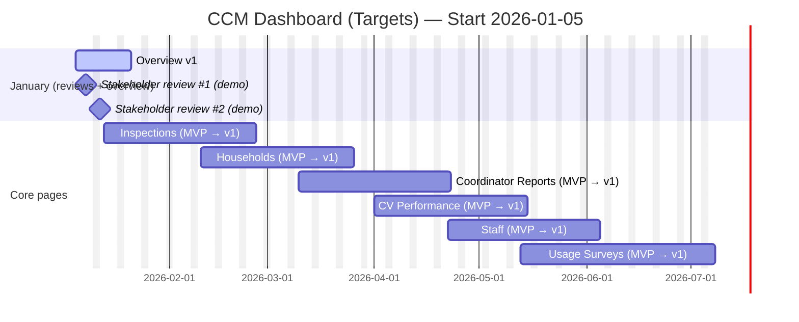

## CCM Dashboard — Page Implementation Timeline (Starting 2026-01-05)

This document proposes a **realistic, review-driven timeline** for implementing each dashboard page with **production (Supabase) data**, starting **Monday 2026-01-05**, assuming a **single developer** (Timothy Miamba) working **~6 hours/day**.

---

### What “implemented” means in this plan

For a page to be considered implemented (v1), it should have:

- **Correct data definitions** agreed with the Data Manager (pre-implementation gate)
- **Live (Supabase) data** for key metrics, tables, and charts (no `~/lib/mock-data`)
- **Filters and export** working for the key use cases (export can be limited/iterative at first)
- **Consistent page header** (year selection is already global; project summary access is addressed below)
- **Stakeholder acceptance** (post-implementation gate)

---

### Roles & accountability

- **Developer**: Timothy Miamba (single implementer)
- **Accountable / Sponsor**: Data Systems Manager (final accountability)
- **Pre-implementation approver**: Data Manager (reviews each page before build starts)
- **Stakeholders**: Page-specific reviewers (operations, field teams, M&E, leadership) — reviewed after each page is implemented

---

### Known constraints and planning assumptions

- **Capacity**: ~6h/day, ~5 workdays/week.
- **Focus factor (realistic)**: plan assumes ~15–25% time goes to meetings, reviews, context switching, and admin; the timeline already includes buffer for that.
- **Field work**: developer is unavailable **1 week every month**. Dates vary; the schedule below assumes **one “no-delivery” week per month**, which can shift exact calendar dates.
- **Unplanned work**: occasional support for other company projects can happen; plan includes buffer to avoid overpromising.
- **Review gates add calendar time**:
  - **Gate 1 (Data Manager)** happens _before_ coding starts; likely requires adjustments.
  - **Gate 2 (Stakeholders)** happens _after_ the page is demo-ready; changes are likely.

---

### Scope notes: Overview page (Main)

- **Keep**: Key metrics/stat cards and core overview structure.
- **Leave out (explicitly)**:
  - Active Stoves Per VPA
  - Data Quality Alerts
  - Survey Completion
- **Required change**: On the Overview page only, the **Project Summary must be shown in full at the top**, together with the other stats (**not** behind a dialog).
- **Every other page**: keep a **Project Summary dialog** accessible at the top of the page (via a standard header action).

---

### Delivery approach (sweet spot: speed + quality + realism)

- **Pipeline pages to reduce idle time**:
  - While waiting for stakeholder feedback on Page A, do Data Manager pre-review + data mapping for Page B.
- **Two milestones per page**:
  - **MVP (demo-ready)**: correct data + core UX flows + basic export.
  - **v1 (accepted)**: incorporates stakeholder feedback, edge cases, and polish.
- **WIP limit**: keep **1 page in build** at a time (single developer), but allow **next-page spec review** in parallel.

---

### January 2026 (detailed plan, due to scheduled reviews)

#### Week of 2026-01-05

- **Deliverable for stakeholder review (Thu 2026-01-08)**:
  - Overview page: remove the 3 omitted components, update layout direction for project summary (start).
  - Capture stakeholder expectations for “what data they should expect” (create a tracked backlog of questions/requests).

#### Week of 2026-01-12

- **Deliverable for stakeholder review (Mon 2026-01-12)**:
  - Overview page: **Project Summary displayed inline** at top (Overview-specific), with the other stats.
  - A short “first view of data” walkthrough: what’s real, what’s placeholder, what’s next.
- **Post-meeting buffer (rework likely)**:
  - Allocate **2–4 working days** immediately after 2026-01-12 for the changes that will inevitably come out of the first data walkthrough.

> After 2026-01-12, the plan shifts to a rolling cadence: implement the next page by priority, then review + iterate.

---

### Page-by-page timeline (priority order)

Dates are **targets** and assume:

- 1 week/month fieldwork (no delivery)
- meaningful stakeholder change requests (likely)
- Data Manager pre-review for each page

#### 1) Main / Overview (`/`)

- **Target window**: 2026-01-05 → 2026-01-17
- **Effort (dev time)**: ~3–5 working days
- **Review gates**:
  - **Stakeholder demos**: 2026-01-08 and 2026-01-12
- **Notes**:
  - Implement the **inline Project Summary** (Overview only).
  - Keep a **Project Summary dialog** pattern for other pages.

#### 2) Inspections (`/inspections`)

- **Target window**: 2026-01-13 → 2026-02-14
- **Effort (dev time)**: ~7–10 working days (plus revisions)
- **Data Manager pre-review (Gate 1)**: week of 2026-01-13 (before deep implementation)
- **Stakeholder review (Gate 2)**: late Jan / early Feb (after MVP demo)
- **Notes / dependencies**:
  - Convert from mock data to Supabase queries/RPCs; confirm inspection KPIs + filters.
  - This page is first after Main, so it will establish the reusable patterns for tables, charts, and exports.

#### 3) Households (`/households`)

- **Target window**: 2026-02-10 → 2026-03-14
- **Effort (dev time)**: ~7–10 working days (plus revisions)
- **Data Manager pre-review (Gate 1)**: during late Inspections build (to pipeline)
- **Stakeholder review (Gate 2)**: early/mid March
- **Notes / dependencies**:
  - Reuse filter/export patterns proven in Inspections.
  - Align on definitions for inspection status (0–3 / 3–6 / 6+ / uninspected) and archived flags.

#### 4) Coordinator Monthly Reports (`/coordinator-reports`)

- **Target window**: 2026-03-10 → 2026-04-11
- **Effort (dev time)**: ~5–8 working days (plus revisions)
- **Data Manager pre-review (Gate 1)**: early March
- **Stakeholder review (Gate 2)**: late March / early April
- **Notes**:
  - Requires clarity on where reports live in the database, expected fields, and export needs.

#### 5) CV Performance (`/cv-performance`)

- **Target window**: 2026-04-01 → 2026-05-03
- **Effort (dev time)**: ~5–8 working days (plus revisions)
- **Data Manager pre-review (Gate 1)**: late March
- **Stakeholder review (Gate 2)**: late April
- **Notes**:
  - Likely depends on agreed performance definitions (targets, time windows, supervisor hierarchy).

#### 6) Staff (`/staff`)

- **Target window**: 2026-04-22 → 2026-05-24
- **Effort (dev time)**: ~5–8 working days (plus revisions)
- **Data Manager pre-review (Gate 1)**: early/mid April
- **Stakeholder review (Gate 2)**: mid/late May
- **Notes**:
  - This page already has strong UI scaffolding; primary work is real data + correct definitions.

#### 7) Usage Surveys (`/usage-surveys`)

- **Target window**: 2026-05-13 → 2026-06-21
- **Effort (dev time)**: ~6–9 working days (plus revisions)
- **Data Manager pre-review (Gate 1)**: early May
- **Stakeholder review (Gate 2)**: June
- **Notes**:
  - Survey data often triggers many “definition” questions; expect more feedback than average.

#### 8) Not Active (`/not-active`)

- **Target window**: 2026-06-10 → 2026-07-05
- **Effort (dev time)**: ~3–5 working days (plus revisions)
- **Notes**:
  - Depends on standardizing “not active” reasons + source-of-truth fields.

#### 9) Archived (`/archived`)

- **Target window**: 2026-06-24 → 2026-07-19
- **Effort (dev time)**: ~3–5 working days (plus revisions)
- **Notes**:
  - Clarify restore behavior (UI-only vs true restore).

#### 10) Data Extraction (`/data-extraction`) _(admin / controlled access recommended)_

- **Target window**: 2026-07-08 → 2026-08-23
- **Effort (dev time)**: ~8–12 working days (plus revisions)
- **Notes**:
  - Higher-risk page (large exports, performance, permissions).
  - Likely needs an explicit access control decision (who can export what).

#### 11) Local Authorities (`/local-authorities`) _(least privilege / lowest priority)_

- **Target window**: 2026-08-05 → 2026-08-31
- **Effort (dev time)**: ~2–4 working days (plus revisions)
- **Notes**:
  - “Least privilege” suggests it should be **restricted** (role-gated) and safe-by-default.

---

### Future development pages (currently marked “Soon” in the sidebar)

These are present as routes but treated as later-scope until the core pages stabilize.

#### KPT Surveys (`/kpt-surveys`)

- **Target window**: 2026-09 (tentative)
- **Notes**: best implemented by extending the shared survey patterns after Usage Surveys is stable.

#### SDG Surveys (`/sdg-surveys`)

- **Target window**: 2026-09/10 (tentative)

#### Training (`/training`)

- **Target window**: TBD (requires requirements + data model)

#### System (`/system`)

- **Target window**: TBD (often expands; should be scoped tightly before committing dates)

---

### Risks & buffers (explicitly planned for)

- **High feedback probability in January**: the 2026-01-08 and 2026-01-12 reviews are first exposure to expected data → budgeted immediate rework time.
- **Fieldwork week**: assume 1 week/month with no feature delivery → pushes calendar dates.
- **Data definition churn**: mitigated by Data Manager pre-review gate per page.
- **Performance/permissions** (especially exports): mitigated by implementing controlled-access patterns early and using incremental rollout for heavy exports.

---

### Suggested artefacts to visualise the timeline and tasks

- **Gantt chart / Roadmap timeline** (Notion, Jira Advanced Roadmaps, Linear Roadmap, or Mermaid in docs)
- **Kanban board** (Backlog → Ready (DM Approved) → In Progress → In Stakeholder Review → Done)
- **Sprint plan + review notes** (biweekly doc capturing what was demoed + decisions)
- **Stakeholder feedback log** (date, page, request, priority, status, decision)
- **Data dictionary / metric definitions** (single source of truth for filters and KPI formulas)
- **RACI matrix** per page (who approves, who is consulted, who is informed)
- **Release checklist** per page (permissions, performance checks, export safety, UX review)

---

### Optional: Mermaid Gantt snippet (copy into a Mermaid-enabled viewer)

